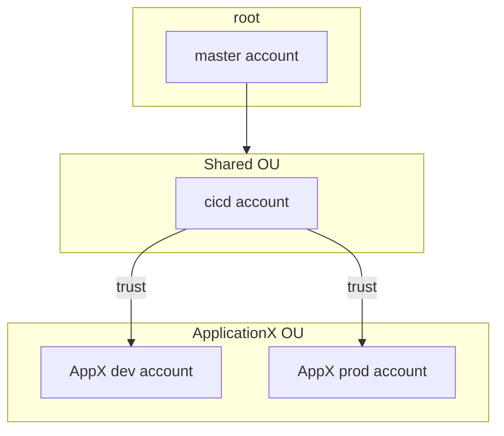

# Cdk Pipelines with accounts setup

This is CDK learning project that teaches how to setup AWS accounts for CDK Pipelines from ground up.

# AWS Organizations

We assume one existing aws account with admin permissions. We are going to setup following structure.

There are three organization units (ou):
1. Shared OU for CICD account with Codepipeline to deploy applications in target accounts
2. ApplicationX OU for accounts to develop, test and deploy applicationX

`npm install -g aws-organization-formation`